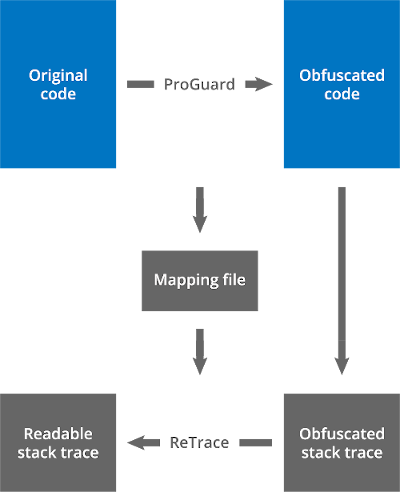

# ReTrace

**ReTrace** is a companion tool for ProGuard and DexGuard that
'de-obfuscates' stack traces.

When an obfuscated program throws an exception, the resulting stack
trace typically isn't very informative. Class names and method names
have been replaced by short meaningless strings. Source file names and
line numbers are missing altogether. While this may be intentional, it
can also be inconvenient when debugging problems.

ReTrace can read an obfuscated stack trace and restore it to what it
would look like without obfuscation. The restoration is based on the
mapping file that an obfuscator (like ProGuard, DexGuard or R8) can write out while obfuscating. The mapping
file links the original class names and class member names to their
obfuscated names.

## Usage {: #usage }

You can find the ReTrace jar in the `lib` directory of the ProGuard
distribution. To run ReTrace, just type:

`java -jar retrace.jar `\[*options...*\] *mapping\_file*
\[*stacktrace\_file*\]

Alternatively, the `bin` directory contains some short Linux and Windows
scripts containing this command. These are the arguments:

*mapping\_file*
: Specifies the name of the mapping file.

*stacktrace\_file*
: Optionally specifies the name of the file containing the stack trace. If
  no file is specified, a stack trace is read from the standard input. The
  stack trace must be encoded with UTF-8 encoding. Blank lines and
  unrecognized lines are ignored.

The following options are supported:

`-verbose`
: Specifies to print out more informative stack traces that include not only
  method names, but also method return types and arguments.

`-regex` *regular\_expression*

: Specifies the regular expression that is used to parse the lines in the
  stack trace. Specifying a different regular expression allows to
  de-obfuscate more general types of input than just stack traces. A relatively
  simple expression like this works for basic stack trace formats:

        (?:.*? at %c\.%m\(%s(?::%l)?\))|(?:(?:.*?[:"] +)?%c(?::.*)?)

  It for instance matches the following lines:

    Exception in thread "main" myapplication.MyException: Some message
        at com.example.MyClass.myMethod(MyClass.java:123)

  The regular expression is a Java regular expression (cfr. the
  documentation of `java.util.regex.Pattern`), with a few additional
  wildcards:

  | Wildcard | Description                                | Example
  |----------|--------------------------------------------|-------------------------------------------
  | `%c`     | matches a class name                       | `com.example.MyClass`
  | `%C`     | matches a class name with slashes          | `com/example/MyClass`
  | `%t`     | matches a field type or method return type | `com.example.MyClass[]`
  | `%f`     | matches a field name                       | `myField`
  | `%m`     | matches a method name                      | `myMethod`
  | `%a`     | matches a list of method arguments         | `boolean,int`
  | `%s`     | matches a source file name                 | `MyClass.java`
  | `%l`     | matches a line number inside a method      | `123`

  Elements that match these wildcards are de-obfuscated,
  when possible. Note that regular expressions must not contain any
  capturing groups. Use non-capturing groups instead: `(?:`...`)`

  You can print out the default regular expression by running ReTrace without
  arguments. It also matches more complex stack traces.

The restored stack trace is printed to the standard output. The
completeness of the restored stack trace depends on the presence of line
number tables in the obfuscated class files:

- If all line numbers have been preserved while obfuscating the
  application, ReTrace will be able to restore the stack
  trace completely.
- If the line numbers have been removed, mapping obfuscated method
  names back to their original names has become ambiguous. Retrace
  will list all possible original method names for each line in the
  stack trace. The user can then try to deduce the actual stack trace
  manually, based on the logic of the program.

Source file names are currently restored based on the names of the
outer-most classes. If you prefer to keep the obfuscated name, you can
replace `%s` in the default regular expression by `.*`

Unobfuscated elements and obfuscated elements for which no mapping is
available will be left unchanged.

## Examples {: #examples }

### Restoring a stack trace with line numbers {: #with}

Assume for instance an application has been obfuscated using the
following extra options:

    -printmapping mapping.txt

    -renamesourcefileattribute MyApplication
    -keepattributes SourceFile,LineNumberTable

Now assume the processed application throws an exception:

    java.io.IOException: Can't read [dummy.jar] (No such file or directory)
        at proguard.y.a(MyApplication:188)
        at proguard.y.a(MyApplication:158)
        at proguard.y.a(MyApplication:136)
        at proguard.y.a(MyApplication:66)
        at proguard.ProGuard.c(MyApplication:218)
        at proguard.ProGuard.a(MyApplication:82)
        at proguard.ProGuard.main(MyApplication:538)
    Caused by: java.io.IOException: No such file or directory
        at proguard.d.q.a(MyApplication:50)
        at proguard.y.a(MyApplication:184)
        ... 6 more

If we have saved the stack trace in a file `stacktrace.txt`, we can use
the following command to recover the stack trace:

    retrace mapping.txt stacktrace.txt

The output will correspond to the original stack trace:

    java.io.IOException: Can't read [dummy.jar] (No such file or directory)
        at proguard.InputReader.readInput(InputReader.java:188)
        at proguard.InputReader.readInput(InputReader.java:158)
        at proguard.InputReader.readInput(InputReader.java:136)
        at proguard.InputReader.execute(InputReader.java:66)
        at proguard.ProGuard.readInput(ProGuard.java:218)
        at proguard.ProGuard.execute(ProGuard.java:82)
        at proguard.ProGuard.main(ProGuard.java:538)
    Caused by: java.io.IOException: No such file or directory
        at proguard.io.DirectoryPump.pumpDataEntries(DirectoryPump.java:50)
        at proguard.InputReader.readInput(InputReader.java:184)
        ... 6 more

### Restoring a stack trace with line numbers (verbose) {: #withverbose}

In the previous example, we could also use the verbose flag:

    java -jar retrace.jar -verbose mapping.txt stacktrace.txt

The output will then look as follows:

    java.io.IOException: Can't read [dummy.jar] (No such file or directory)
        at proguard.InputReader.void readInput(java.lang.String,proguard.ClassPathEntry,proguard.io.DataEntryReader)(InputReader.java:188)
        at proguard.InputReader.void readInput(java.lang.String,proguard.ClassPath,int,int,proguard.io.DataEntryReader)(InputReader.java:158)
        at proguard.InputReader.void readInput(java.lang.String,proguard.ClassPath,proguard.io.DataEntryReader)(InputReader.java:136)
        at proguard.InputReader.void execute(proguard.classfile.ClassPool,proguard.classfile.ClassPool)(InputReader.java:66)
        at proguard.ProGuard.void readInput()(ProGuard.java:218)
        at proguard.ProGuard.void execute()(ProGuard.java:82)
        at proguard.ProGuard.void main(java.lang.String[])(ProGuard.java:538)
    Caused by: java.io.IOException: No such file or directory
        at proguard.io.DirectoryPump.void pumpDataEntries(proguard.io.DataEntryReader)(DirectoryPump.java:50)
        at proguard.InputReader.void readInput(java.lang.String,proguard.ClassPathEntry,proguard.io.DataEntryReader)(InputReader.java:184)
        ... 6 more

### Restoring a stack trace without line numbers {: #without}

Assume for instance the application has been obfuscated using
the following extra options, this time without preserving the line
number tables:

    -printmapping mapping.txt

A stack trace `stacktrace.txt` will then lack line number information,
showing "Unknown source" instead:

    java.io.IOException: Can't read [dummy.jar] (No such file or directory)
        at proguard.y.a(Unknown Source)
        at proguard.y.a(Unknown Source)
        at proguard.y.a(Unknown Source)
        at proguard.y.a(Unknown Source)
        at proguard.ProGuard.c(Unknown Source)
        at proguard.ProGuard.a(Unknown Source)
        at proguard.ProGuard.main(Unknown Source)
    Caused by: java.io.IOException: No such file or directory
        at proguard.d.q.a(Unknown Source)
        ... 7 more

We can still use the same command to recover the stack trace:

    java -jar retrace.jar mapping.txt stacktrace.txt

The output will now list all alternative original method names for each
ambiguous obfuscated method name:

    java.io.IOException: Can't read [dummy.jar] (No such file or directory)
        at proguard.InputReader.execute(InputReader.java)
                                readInput(InputReader.java)
        at proguard.InputReader.execute(InputReader.java)
                                readInput(InputReader.java)
        at proguard.InputReader.execute(InputReader.java)
                                readInput(InputReader.java)
        at proguard.InputReader.execute(InputReader.java)
                                readInput(InputReader.java)
        at proguard.ProGuard.readInput(ProGuard.java)
        at proguard.ProGuard.execute(ProGuard.java)
                             optimize(ProGuard.java)
                             createPrintStream(ProGuard.java)
                             closePrintStream(ProGuard.java)
                             fileName(ProGuard.java)
        at proguard.ProGuard.main(ProGuard.java)
    Caused by: java.io.IOException: No such file or directory
        at proguard.io.DirectoryPump.pumpDataEntries(DirectoryPump.java)
                                     readFiles(DirectoryPump.java)

For instance, ReTrace can't tell if the method `a` corresponds to
`execute` or to `readInput`, so it lists both. You need to figure it out
based on your knowledge of the application. Having line numbers and
unambiguous names clearly is a lot easier, so you should consider
[preserving the line numbers](../configuration/examples.md#stacktrace) when you
obfuscate your application.

## Specifications {: #specifications }

A mapping file contains the original names and the obfuscated names of
classes, fields, and methods. ProGuard can write out such a file while
obfuscating an application or a library, with the option
[`-printmapping`](../configuration/usage.md#printmapping). ReTrace requires the mapping file
to restore obfuscated stack traces to more readable versions. It is a readable
file with UTF-8 encoding, so you can also look up names in an ordinary text
viewer. The format is pretty self-explanatory, but we describe its details
here.

A mapping file contains a sequence of records of the following form:

    classline
        fieldline *
        methodline *

A `classline`, with a trailing colon, specifies a class and its obfuscated
name:

    originalclassname -> obfuscatedclassname:

A `fieldline`, with 4 leading spaces, specifies a field and its obfuscated
name:

        originalfieldtype originalfieldname -> obfuscatedfieldname

A `methodline`, with 4 leading spaces, specifies a method and its obfuscated
name:

        [startline:endline:]originalreturntype [originalclassname.]originalmethodname(originalargumenttype,...)[:originalstartline[:originalendline]] -> obfuscatedmethodname

- An asterisk "*" means the line may occur any number of times. 
- Square brackets "\[\]" mean that their contents are optional. 
- Ellipsis dots "..." mean that  any number of the preceding items may be specified. 
- The colon ":", the separator ".", and the arrow "->" are literal tokens.

### Example

The following snippet gives an impression of the structure of a mapping file:

    com example.application.ArgumentWordReader -> com.example.a.a:
        java.lang.String[] arguments -> a
        int index -> a
        36:57:void <init>(java.lang.String[],java.io.File) -> <init>
        64:64:java.lang.String nextLine() -> a
        72:72:java.lang.String lineLocationDescription() -> b
    com.example.application.Main -> com.example.application.Main:
        com.example.application.Configuration configuration -> a
        50:66:void <init>(com.example.application.Configuration) -> <init>
        74:228:void execute() -> a
        2039:2056:void com.example.application.GPL.check():39:56 -> a
        2039:2056:void execute():76 -> a
        2236:2252:void printConfiguration():236:252 -> a
        2236:2252:void execute():80 -> a
        3040:3042:java.io.PrintWriter com.example.application.util.PrintWriterUtil.createPrintWriterOut(java.io.File):40:42 -> a
        3040:3042:void printConfiguration():243 -> a
        3040:3042:void execute():80 -> a
        3260:3268:void readInput():260:268 -> a
        3260:3268:void execute():97 -> a

You can see the names of classes and their fields and methods:

- The fields and methods are listed in ProGuard configuration format (javap
  format), with descriptors that have return types and argument types but no
  argument names. In the above example:

        void <init>(java.lang.String[],java.io.File)

    refers to a constructor with a `String` array argument and a `File`
    argument.

- A method may have a leading line number range, if it is known from the
  original source code (see [Producing useful obfuscated stack
  traces](../configuration/examples.md#stacktrace) in the Examples section). Unlike method
  names, line numbers are unique within a class, so ReTrace can resolve lines
  in a stack trace without ambiguities. For example:

        74:228:void execute()

    refers to a method `execute`, defined on lines 74 to 228.

- The obfuscated method name follows the arrow. For example:

        74:228:void execute() -> a

    shows that method `execute` has been renamed to `a`. Multiple fields and
    methods can get the same obfuscated names, as long as their descriptors
    are different.

### Inlined methods

The mapping file accounts for the added complexity of inlined methods (as of
ProGuard/ReTrace version 5.2). The optimization step may inline methods
into other methods &mdash; recursively even. A single line in an obfuscated
stack trace can then correspond to multiple lines in the original stack trace:
the line that throws the exception followed by one or more nested method
calls. In such cases, the mapping file repeats the leading line number range
on subsequent lines. For example:

    3040:3042:java.io.PrintWriter com.example.application.util.PrintWriterUtil.createPrintWriterOut(java.io.File):40:42 -> a
    3040:3042:void printConfiguration():243 -> a
    3040:3042:void execute():80 -> a

- The subsequent lines correspond to the subsequent lines of the original
  stack trace. For example:

        3040:3042:java.io.PrintWriter com.example.application.util.PrintWriterUtil.createPrintWriterOut(java.io.File):40:42 -> a
        3040:3042:void printConfiguration():243 -> a
        3040:3042:void execute():80 -> a

    refers to method `createPrintWriterOut` called from and inlined in
    `printConfiguration`, in turn called from and inlined in method `execute`.

- An original method name may have a preceding class name, if the method
  originates from a different class. For example:

        3040:3042:java.io.PrintWriter com.example.application.util.PrintWriterUtil.createPrintWriterOut(java.io.File):40:42 -> a

    shows that method `createPrintWriterOut` was originally defined in class
    `PrintWriterUtil`.

- A single trailing line number corresponds to an inlined method call. For
  example:

        3040:3042:java.io.PrintWriter com.example.application.util.PrintWriterUtil.createPrintWriterOut(java.io.File):40:42 -> a
        3040:3042:void printConfiguration():243 -> a
        3040:3042:void execute():80 -> a

    specifies that method `execute` called `printConfiguration` on line 80,
    and `printconfiguration` called `createPrintWriterOut` on line 243.

- A traling line number range corresponds to the final inlined method body.
  For example:

        3040:3042:java.io.PrintWriter com.example.application.util.PrintWriterUtil.createPrintWriterOut(java.io.File):40:42 -> a

    shows that method `createPrintWriterOut` covered lines 40 to 42.

- The leading line number range is synthetic, to avoid ambiguities with other
  code in the same class. ProGuard makes up the range, but tries to make it
  similar-looking to the original code (by adding offsets that are multiples
  of 1000), for convenience. For example:

        3040:3042:java.io.PrintWriter com.example.application.util.PrintWriterUtil.createPrintWriterOut(java.io.File):40:42 -> a

    created synthetic range 3040:3042 in the bytecode of class `Main` to be
    unique but still resemble source code range 40:42 in class
    `PrintWriterUtil`.

Tools that don't account for these repeated line number ranges, like older
versions of ReTrace, may still degrade gracefully by outputting the subsequent
lines without interpreting them.
